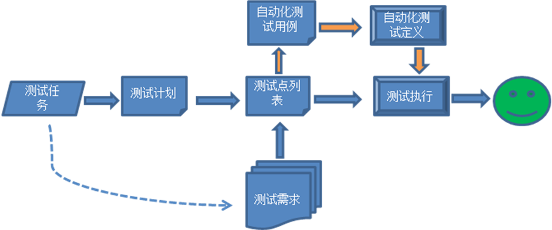
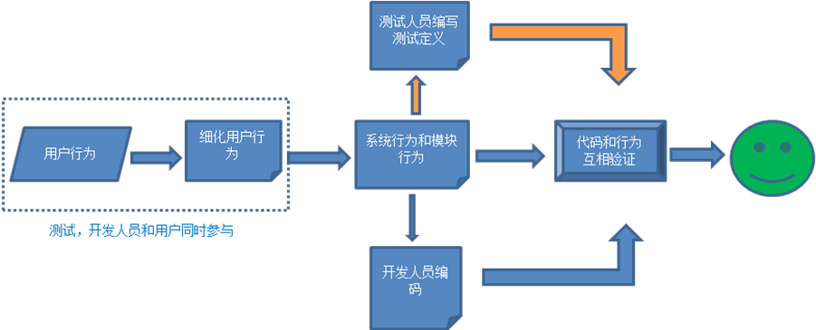
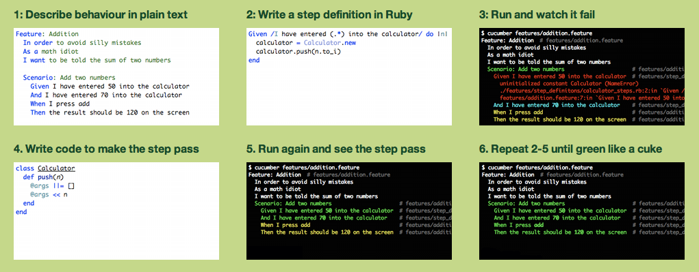
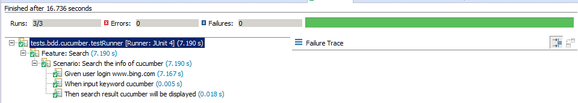
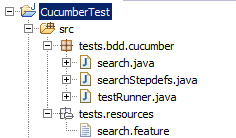

# 测试mdtowiki命令

## 本地图片

图片1：标准插入，图片前后有特殊字符

testtests

图片2：带缩放标识

图片3：

图片4：

图片5：

图片6：图片重复的情况

## 网络图片

图片1：百度

图片2：163，带缩放

## 链接

[文件](mdtowiki_pic/文件.txt)

[图片链接](mdtowiki_pic/img003.png)

## 自带与mediawiki相同的图像标签

[[Image:Wiki_sample.png|70px|left]]